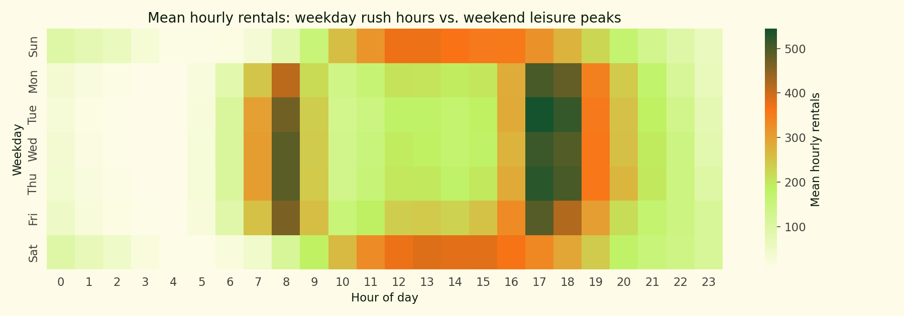
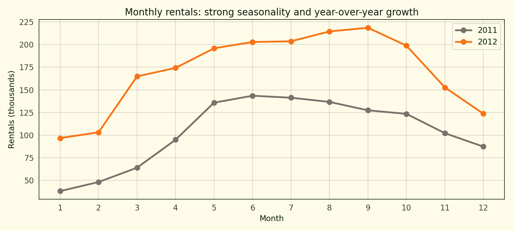
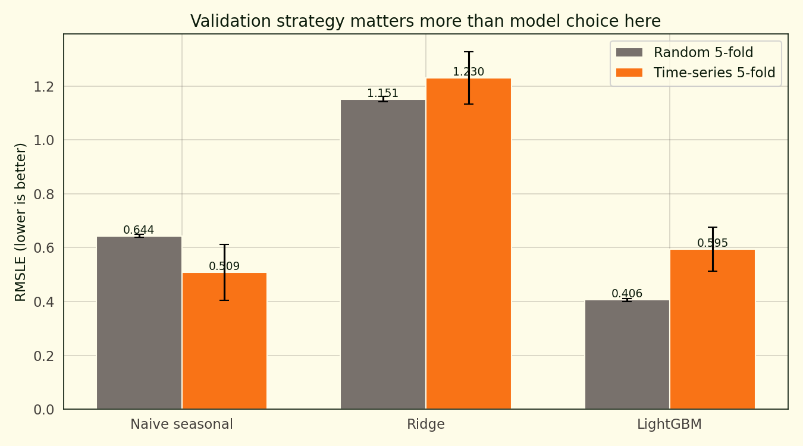
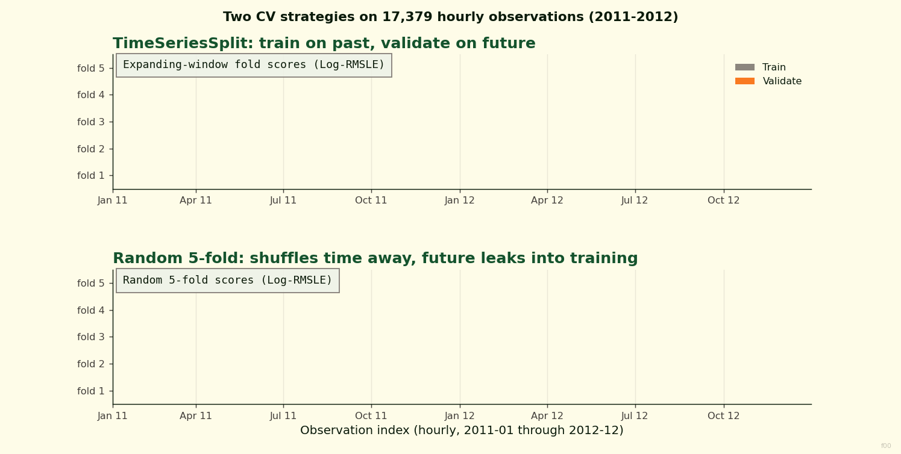

# When a Naive Baseline Beats LightGBM: Bike-Sharing Demand with Proper Time-Series Cross-Validation

Running the UCI hourly bike-sharing dataset through a random 5-fold cross-validation, LightGBM comes out at 0.405 RMSLE and looks like the obvious winner. Running the same data through a TimeSeriesSplit cross-validation — where each fold's training set is everything before a certain date and the validation set is what comes next — LightGBM lands at 0.595 RMSLE and gets beaten by a naive "seasonal mean of (hour, weekday)" baseline that scores 0.509.

That's the whole story of this project. Validation strategy matters more than model choice when your data has time structure. Random k-fold shuffles the time dimension away, which means the training fold always contains observations from the future relative to the validation fold. The model learns from information it won't have at inference time, and the cross-validation score flatters it accordingly.

## The dataset

17,379 hourly observations from the UCI Bike Sharing Dataset (Capital Bikeshare, Washington DC, 2011-2012), with 14 weather and calendar features per observation. The target is `cnt`, the total number of rentals in that hour. Data runs continuously from 2011-01-01 to 2012-12-31.

The hour-weekday heatmap shows the shape of the demand. Weekday mornings hit a sharp 8am peak, a smaller noon bump, and a bigger 5-6pm peak — classic commuter pattern. Weekends are flatter with a single broad afternoon bulge from 11am to 6pm. That bimodal weekday pattern vs. the unimodal weekend pattern is why a naive seasonal baseline indexed on (weekday, hour) does so well.

The monthly totals trace out the seasonal shape — summer peaks, winter troughs — and grow about 65 percent between 2011 and 2012 as the bike-share program matured. That year-over-year growth is another reason time-series CV matters: random k-fold lets the model see 2012 growth during training on "2011 test" folds, which doesn't happen in deployment.

## The story: validation strategy

Three models, two cross-validation strategies, six bars.

| Model | Random k-fold RMSLE | Time-series CV RMSLE |
| --- | ---: | ---: |
| Naive seasonal mean (weekday × hour) | 0.644 | **0.509** |
| Ridge with cyclical features | 1.151 | 1.230 |
| LightGBM with seasonal features | **0.405** | 0.595 |

Under random k-fold, LightGBM wins by a wide margin. Under time-series CV, the naive seasonal baseline wins instead. LightGBM's time-series score is 47 percent worse than its k-fold score; the naive baseline's time-series score is actually 21 percent better than its k-fold score (because time-series CV happens to evaluate on the later, more-complete year of data where the seasonal mean is more stable).

The ridge model is terrible in both cases — log-RMSLE above 1.0 means multiplicative errors of 2-3x on typical predictions. Linear models don't handle cyclical demand patterns well, even with `sin(hour)` and `cos(hour)` features.

## Why random k-fold is misleading here

The time-series split is simple: for fold k, train on everything before timestamp T(k), validate on the next chunk. Training set grows with each fold; validation window slides forward. That mirrors what actually happens at deployment — you train on the past, predict the future.

Random 5-fold ignores the time dimension. For a training fold containing 80 percent of the data drawn uniformly at random, the model sees observations from December 2012 while validating on April 2011 and vice versa. That's information leakage. The model is being told what the trend looks like in the future, which it uses to fit the validation fold better than it has any business doing.

On this dataset the leakage effect is visible even in the naive baseline, which isn't a trained model at all — it's just the mean of `cnt` grouped by (weekday, hour). Under random k-fold, the validation fold contains rows from all 24 months; the seasonal mean is computed on training data that also spans all 24 months. Both contain the same level of year-over-year growth, so the residuals are small. Under time-series CV, the training set is pre-validation; the seasonal mean is computed on data that may not include the validation period's growth level; residuals are larger.

The net effect: random k-fold overstates the generalisation quality of any time-structured model.

## What beats LightGBM here

Nothing, among the three models tested. LightGBM still has the best time-series RMSLE of 0.595. But the naive baseline's 0.509 sits inside what the full LightGBM model achieves — the base rate of "what's the mean demand for this hour of this weekday" explains more variance than LightGBM's engineered features + weather + seasonal interactions recover on truly unseen future data.

A practical implication: deploying LightGBM on top of the naive baseline as a residual-predictor (model the difference between actual demand and the seasonal mean, then add the two at inference time) often works better than deploying LightGBM directly. That approach isn't in this project, but it's the natural next step.

## What this isn't

Not a Kaggle-winning submission. The Kaggle Bike Sharing Demand leaderboard uses RMSLE against a held-out test set from the same time window, so random sampling gives a reasonable approximation of what the public leaderboard measures. This project is explicitly about the difference between that and real deployment; for Kaggle submissions, the random score is the number that matters.

Not a test of modern time-series models either. No prophet, no LSTM, no Temporal Fusion Transformer. The point isn't that neural networks can't beat LightGBM here (they probably can, given enough data) — the point is that any model you put into production needs time-respecting validation to know what score it'll actually hit.

## References

Fanaee-T, H., & Gama, J. (2014). Event labeling combining ensemble detectors and background knowledge. *Progress in Artificial Intelligence*, 2(2-3), 113-127.

Ke, G., Meng, Q., Finley, T., Wang, T., Chen, W., Ma, W., Ye, Q., & Liu, T.-Y. (2017). LightGBM: A highly efficient gradient boosting decision tree. *Advances in Neural Information Processing Systems*, 30.

Bergmeir, C., & Benítez, J. M. (2012). On the use of cross-validation for time series predictor evaluation. *Information Sciences*, 191, 192-213.

Hyndman, R. J., & Athanasopoulos, G. (2021). *Forecasting: Principles and Practice* (3rd ed.). OTexts.
